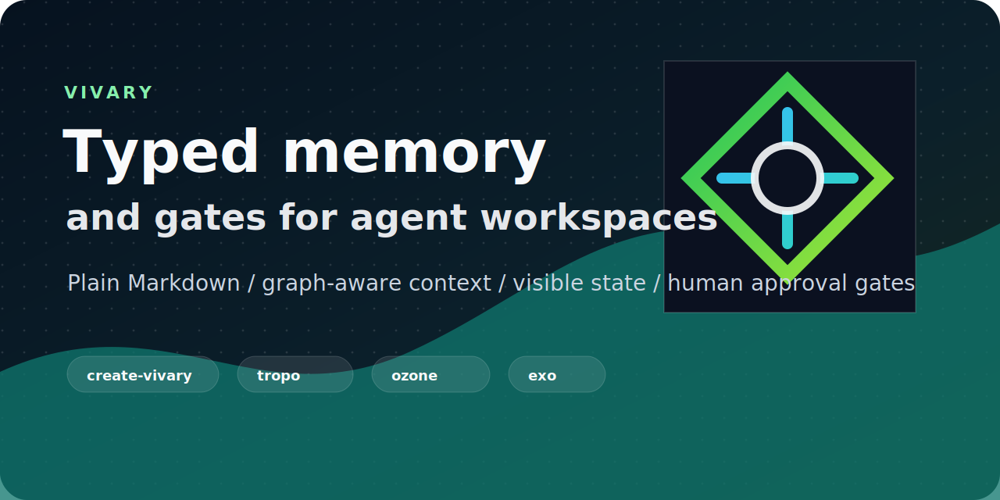

# Vivary

Vivary builds agent-workspace infrastructure for software projects, second brains, knowledge work, and writing systems.

The goal is simple: keep AI-assisted work visible, grounded, inspectable, and easy to resume.

## Start Here

| Link | What to look for |
| --- | --- |
| [**Vivary**](https://github.com/vivary-dev/vivary) | The main monorepo: `create-vivary`, typed memory, graph search, review gates, coordination, docs, and release workflow. |
| [**Docs**](https://vivary.vercel.app) | Getting started, commands, architecture, active context, semantic memory, and workflow recipes. |
| [**npm package**](https://www.npmjs.com/package/@vivary/create) | `npm create @vivary@latest` launcher for scaffolding agent workspaces. |
| [**PyPI packages**](https://pypi.org/project/create-vivary/) | Python command surfaces for `create-vivary`, `tropo`, `ozone`, and `exo`. |

## What Vivary Cares About

- Typed memory and graph-aware context.
- Visible project state instead of hidden chat history.
- Reusable skills, review gates, and human approval boundaries.
- Plain Markdown first, external memory/search as optional capability.
- Small, inspectable systems that agents and humans can both understand.
